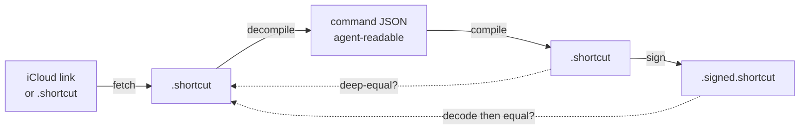
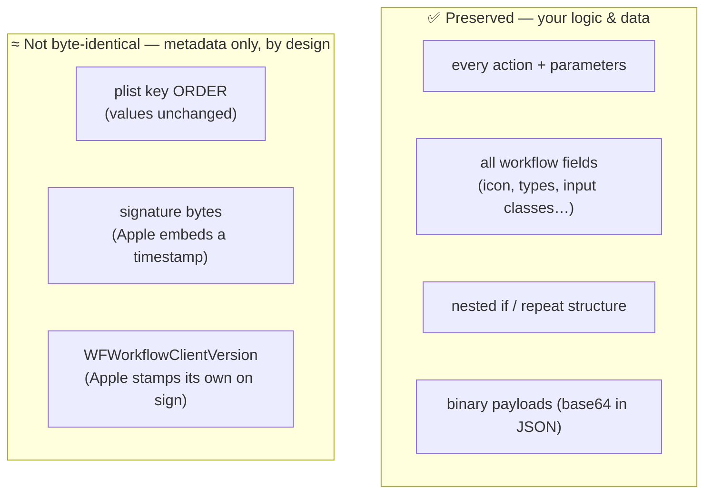

# Benchmark — Lossless Round-Trip Integrity

[English](BENCHMARK.md) · [中文](BENCHMARK.zh.md) · [← README](README.md)

**Claim:** `shortcut-cli` converts a Shortcut to an agent-readable command (JSON) and back **without losing anything** — every action, every field, every nested `if`/`repeat`. This page shows it, on real Shortcuts, with a script you can re-run yourself.

## The loop under test



Every arrow is run repeatedly; the dotted arrows are the checks. **Correctness is judged by deep value comparison** (does every field/action match by value) — *not* by byte or text equality. Byte equality is the wrong test here: a binary plist normalizes key order, and Apple's signature embeds a fresh timestamp, so two correct files are never byte-identical.

## Results

Three real Shortcuts of increasing complexity (anonymized to action count + structure):

| Sample | Actions | Notable structure | Content preserved | Nested control-flow intact | Reproducible fixed point |
|:---:|:---:|---|:---:|:---:|:---:|
| **A** | 21  | `if` branches, notifications | ✅ 21/21 | ✅ | ✅ |
| **B** | 49  | 7× `if`, date math, photo albums, sub-workflows | ✅ 49/49 | ✅ | ✅ |
| **C** | 61  | 10× `if` (incl. **nested**), 4× `repeat`, regex, rich-text→image | ✅ 61/61 | ✅ | ✅ |

Every action deep-equal · all top-level fields equal · `original == recompiled` · multi-round converges to a stable fixed point · `compile` is byte-deterministic · actions survive signing unchanged. **All pass.**

### Raw output (Sample C, 61 actions)

```
  shortcut: 61 actions
  ----------------------------------------------------
  [PASS] actions preserved (count)              61/61
  [PASS] every action deep-equal
  [PASS] all top-level fields equal
  [PASS] original == recompiled (deep)
  [PASS] multi-round fixed point (j2==j3)
  [PASS] compile deterministic (r1==r2)
  [PASS] control-flow "if" modes preserved      [0, 1, 2, 0, 1, 2, 0, 0, 2, 2]
  [PASS] control-flow "repeat" modes preserved  [0, 2, 0, 2]
  [PASS] actions survive signing                61/61
  [PASS] signing changes only client-version    WFWorkflowClientVersion
  ----------------------------------------------------
  => ALL PASS — content losslessly preserved
```

That `[0, 1, 2, 0, 1, 2, 0, 0, 2, 2]` is the money shot: `0`=block start, `1`=else, `2`=block end. The `…0, 0, 2, 2` is an **`if` nested inside an `if`** — exactly the structure that a naive converter drops on import. It comes through byte-for-byte in meaning.

## What's preserved vs. what isn't (and why)



None of the right-column items change what the Shortcut *does* — they're container/metadata, not content.

## Reproduce it yourself

```bash
python3 benchmark.py https://www.icloud.com/shortcuts/<id>
# or on a local file:
python3 benchmark.py MyShortcut.shortcut
```

Exit code `0` = all checks passed. Point it at your own most-complex Shortcut and see.
