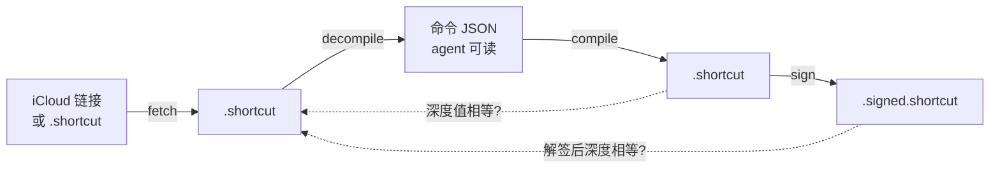
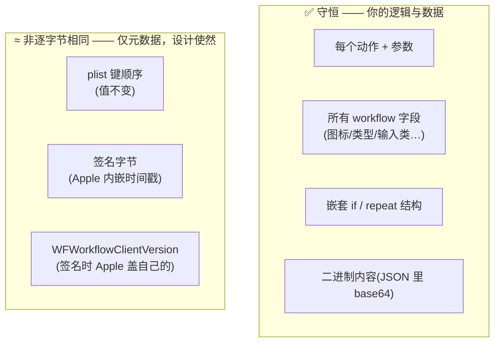

# 基准测试 —— 无损往返完整性

[English](BENCHMARK.md) · [中文](BENCHMARK.zh.md) · [← README](README.zh.md)

**结论：** `shortcut-cli` 把快捷指令转成 agent 可读的命令(JSON)再转回来，**内容零丢失**——每个动作、每个字段、每一层嵌套的 `if`/`repeat` 都在。本页用真实快捷指令证明它，并附上你可以自己复跑的脚本。

## 被测的往返回路



每条实线箭头都反复执行，虚线是校验。**正确性用"深度值比较"判定**（每个字段/动作值是否相等）——**不是**字节或文本相等。字节相等在这里是错的判据：二进制 plist 会规范化键顺序，而 Apple 签名内嵌时间戳，所以两个正确的文件永远不可能逐字节相同。

## 结果

三个真实快捷指令，复杂度递增（脱敏为动作数 + 结构特征）：

| 样本 | 动作数 | 结构特征 | 内容守恒 | 嵌套控制流完整 | 可复验定点 |
|:---:|:---:|---|:---:|:---:|:---:|
| **A** | 21  | `if` 分支、通知 | ✅ 21/21 | ✅ | ✅ |
| **B** | 49  | 7× `if`、日期运算、照片相册、子工作流 | ✅ 49/49 | ✅ | ✅ |
| **C** | 61  | 10× `if`（含**嵌套**）、4× `repeat`、正则、富文本→图片 | ✅ 61/61 | ✅ | ✅ |

逐动作深度相等 · 所有顶层字段相等 · `原始 == 重编译` · 多轮收敛到稳定定点 · `compile` 逐字节确定性 · 动作经签名守恒。**全部通过。**

### 原始输出（样本 C，61 动作）

```
  shortcut: 61 actions
  ----------------------------------------------------
  [PASS] actions preserved (count)              61/61
  [PASS] every action deep-equal
  [PASS] all top-level fields equal
  [PASS] original == recompiled (deep)
  [PASS] multi-round fixed point (j2==j3)
  [PASS] compile deterministic (r1==r2)
  [PASS] control-flow "if" modes preserved      [0, 1, 2, 0, 1, 2, 0, 0, 2, 2]
  [PASS] control-flow "repeat" modes preserved  [0, 2, 0, 2]
  [PASS] actions survive signing                61/61
  [PASS] signing changes only client-version    WFWorkflowClientVersion
  ----------------------------------------------------
  => ALL PASS — content losslessly preserved
```

那串 `[0, 1, 2, 0, 1, 2, 0, 0, 2, 2]` 是关键：`0`=块开始，`1`=else，`2`=块结束。中间的 `…0, 0, 2, 2` 是**一个 `if` 嵌套在另一个 `if` 里**——正是幼稚的转换器一导入就会丢掉的结构。它在含义上被逐一守恒。

## 什么被守恒、什么不守恒（以及为什么）



右列这些都**不改变快捷指令的行为**——是容器/元数据，不是内容。

## 自己复跑

```bash
python3 benchmark.py https://www.icloud.com/shortcuts/<id>
# 或本地文件：
python3 benchmark.py 某个.shortcut
```

退出码 `0` = 全部通过。拿你自己最复杂的快捷指令试试。
